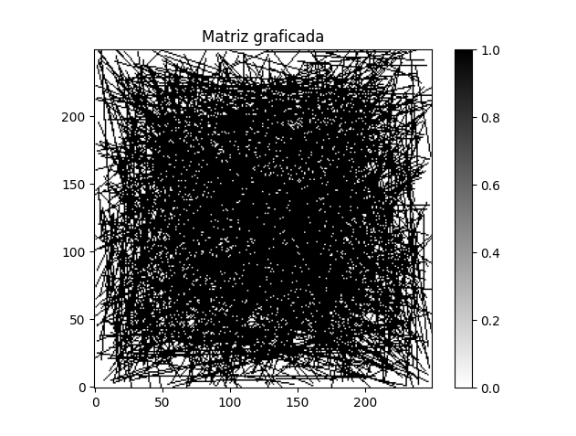

# 🖥️ Disperse

## 📝 Descripción

Un laboratorio especializado en matrices dispersas y la interacción con estas de manera nativa en python, las dependencias se especifican en el archivo `pyproject.toml`.

## 🎯 Objetivos

Ofrecer una solución y alternativa a matrices densas convencionales cuyo enfoque sea la optimización de recursos computacionales.

## 💡 Objetos

Este sistema cuenta con una arquitectura modular y abstracta, lo que hace que sea fácil de comprender, manipular y gestionar, este sistema cuenta con los siguientes objetos:

* Drawer: Un objeto que se encarga de realizar trazos de diferentes tipos en la matriz dispersa.
* Matrix: El objeto que representa a la matriz dispersa.
* Processor: Este objeto te permitirá analizar y abstraer a otro tipo de dato a la matriz
* Generator: Un objeto que se encarga de generar contenido de manera óptima, por ejemplo, generar `x` cantidad de lineas aleatorias. (Para pruebas)